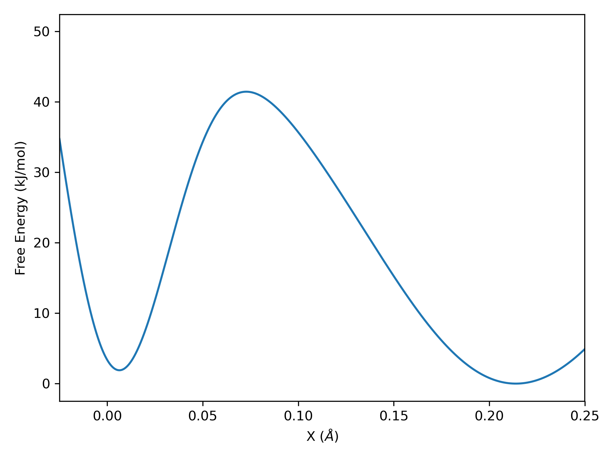

# Build Potential

The code in this folder defines a 1D double-well potential energy surface (seen below).

  

This is supposed to represent some underlying potential energy surface of a system which we may not know the shape of and we want to determine. The files, x_axis.npy and potential.npy, store numpy arrays of the X and Y coordinates of this potential.
